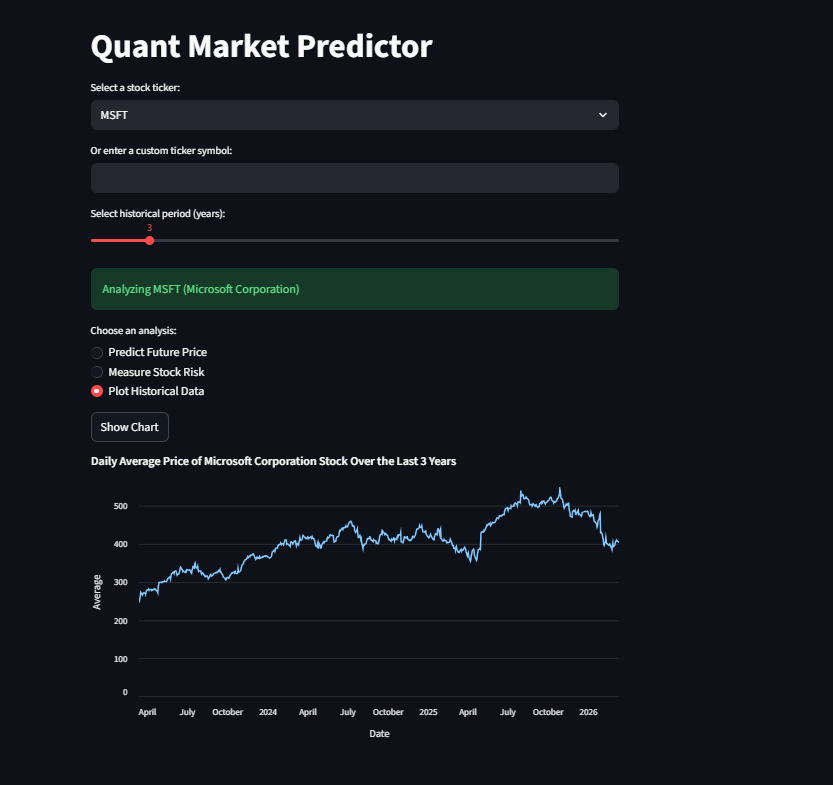
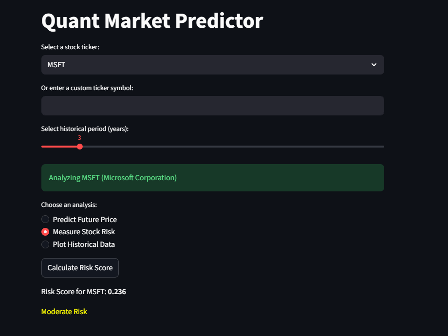
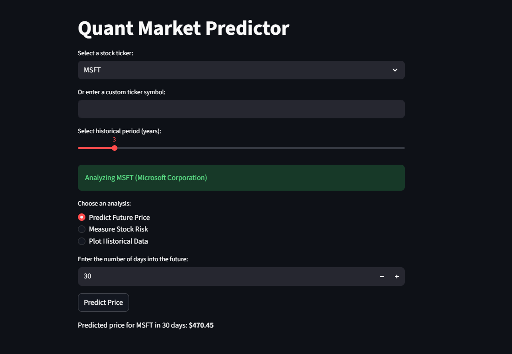

# StockSight 📈


**StockSight** is a quantitative finance and machine learning dashboard that analyzes stock market data and predicts future prices using historical trends.

The project provides:

* 📊 Historical stock visualization
* ⚠️ Volatility-based risk analysis
* 🤖 Machine learning price prediction

All features are accessible through an **interactive Streamlit dashboard**.

---

# Project Overview

StockSight analyzes historical stock data and applies **machine learning models** to estimate future stock prices.

The system performs:

* Financial data collection from Yahoo Finance
* Data preprocessing with Pandas
* Risk and volatility calculations
* Machine learning prediction using Linear Regression
* Interactive visualization with Streamlit

This project is useful for:

* Data science learning
* Quantitative finance practice
* Machine learning experimentation
* Financial data analysis

---

# Demo Dashboard

## 📊 Historical Stock Price Visualization

This visualization shows the **historical daily average price of Microsoft (MSFT)** over the selected time period.

Users can analyze **trends and historical price movements** through an interactive chart.



---

## ⚠️ Stock Risk Analysis

The dashboard calculates a **risk score based on stock volatility**.

In this example, Microsoft shows a **moderate risk level** based on the volatility score.



Example result:

```
Risk Score for MSFT: 0.236
Moderate Risk
```

---

## 🤖 Future Price Prediction

Using a **Linear Regression machine learning model**, the system predicts the future stock price based on historical trends.

Example prediction:

```
Predicted price for MSFT in 30 days: $470.45
```



---

# Project Architecture

```
                +----------------------+
                |  Yahoo Finance API   |
                +----------+-----------+
                           |
                           v
                +----------------------+
                |   Data Processing    |
                |  (Pandas / NumPy)    |
                +----------+-----------+
                           |
                           v
                +----------------------+
                | Machine Learning     |
                | Linear Regression    |
                +----------+-----------+
                           |
                           v
                +----------------------+
                | Visualization Layer  |
                | Streamlit + Altair   |
                +----------------------+
```

---

# Project Structure

```
StockSight
│
├── images
│   ├── plot-data.png
│   ├── stock-risk.png
│   └── predict-future.png
│
├── resources
├── scripts
├── tests
│
├── main.py
├── requirements.txt
├── setup.py
├── LICENSE.txt
└── README.md
```

---

# Installation ⚙️

Clone the repository

```bash
git clone https://github.com/shantanuroy04/quant-market.git
```

Navigate to the project folder

```bash
cd quant-market
```

Install dependencies

```bash
pip install -r requirements.txt
```

---

# Running the Application

Start the Streamlit dashboard

```bash
streamlit run main.py
```

Open the **local Streamlit URL** in your browser.

---

# How to Use

1. Select a **stock ticker** (example: `MSFT`, `AAPL`, `TSLA`)
2. Choose the **historical data period**
3. Select an analysis option:

   * Predict Future Price
   * Measure Stock Risk
   * Plot Historical Data
4. View the results in the dashboard.

---

# Dependencies

Main libraries used:

```
numpy
pandas
scikit-learn
streamlit
altair
yfinance
```

Install them using:

```bash
pip install -r requirements.txt
```

---

# Machine Learning Model

The project currently uses **Linear Regression** to estimate future stock prices based on historical trends.

Possible improvements:

* LSTM neural networks
* ARIMA forecasting models
* Random Forest regression
* Transformer-based time series models

---

# Future Improvements

Potential upgrades:

* Deep learning stock prediction
* Multi-stock portfolio comparison
* Portfolio optimization tools
* Real-time market streaming
* Trading strategy backtesting

---

# Contributing

Contributions are welcome.

1. Fork the repository
2. Create a new branch

```
git checkout -b feature-name
```

3. Commit changes

```
git commit -m "Add feature"
```

4. Push the branch

```
git push origin feature-name
```

5. Open a Pull Request.

---

# License

This project is licensed under the **MIT License**.

See the `LICENSE.txt` file for details.

---

# Disclaimer

This project is **for educational purposes only**.

Stock market predictions generated by this tool **should not be considered financial advice**. Always perform your own research before making investment decisions.
